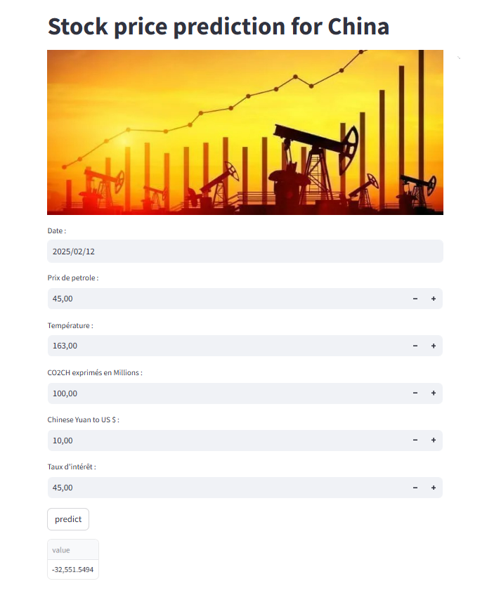

---

# Stock Price Prediction in China

## 👋 Overview
This project utilizes Python, Pandas, and Scikit-learn to clean a given dataset and build a machine learning model for predicting stock prices in China. The project is then transformed into a web application using Streamlit, allowing users to interact with the model and visualize predictions.

## 📚 Technologies Used
- **Python**: Programming language used for data analysis and model building.
- **Pandas**: Library utilized for data cleaning and manipulation.
- **Scikit-learn**: Framework for building and training the predictive model.
- **Streamlit**: Tool for creating the web application to visualize predictions.

## 📊 Dataset
The dataset used in this project contains historical stock prices for various companies in China. Key features may include:
- Date
- Indice des actions (target)
- Température
- Emission CO2
- Taux d'intérêt
- Prix du pétrole

## 🚀 Features
- Data cleaning and preprocessing using Pandas.
- Implementation of a machine learning model using Scikit-learn to predict stock prices.
- Interactive web application built with Streamlit that allows users to:
  - Upload datasets.
  - View cleaned data.
  - Get predictions on stock prices.

## 🛠️ Installation
To run this project locally, follow these steps:

1. Clone the repository:
    ```bash
    git clone https://github.com/yourusername/My-first-Hackathon.git
    cd My-first-Hackathon/streamlit
    ```

2. Install the required packages:
    ```bash
    pip install -r requirements.txt
    ```

## 🧑‍💻 Usage
To start the web application, run:
```bash
streamlit run main.py
```
This command launches the Streamlit app in your web browser, where you can interact with the model.
--- 



---
## 📈 How It Works
1. **Data Cleaning**: Using Pandas, the dataset is cleaned and unnecessary columns are removed. Handling of missing values and normalization of data is also performed.
2. **Model Training**: Scikit-learn is employed to train a machine learning model (Elastic-Net, Random Forest....) on the cleaned dataset.
3. **Web Application**: Streamlit is used to create a user-friendly interface where users can input data and receive predictions.

## 📫 Contact
For any questions or collaboration opportunities, feel free to reach out:
- **Email:** samaalibassem123@gmail.com
- **LinkedIn:** [My linkedin Profile](https://www.linkedin.com/in/bassem-samaali/)

